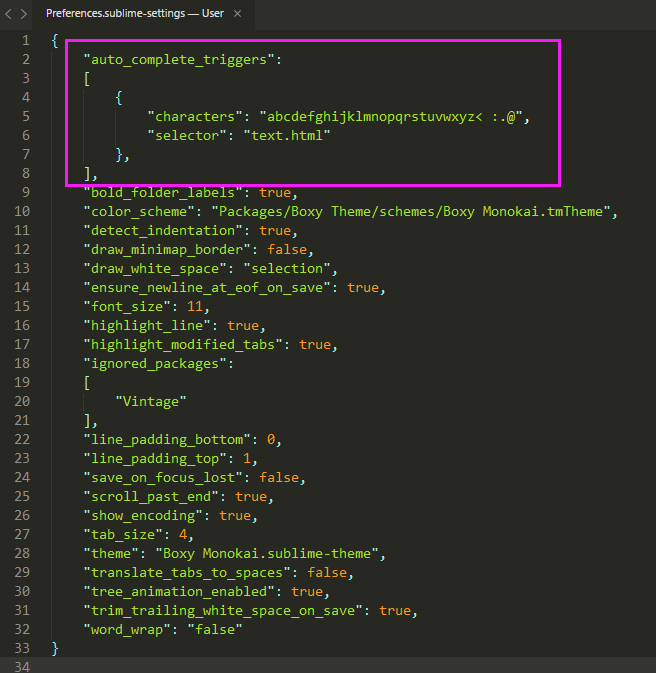
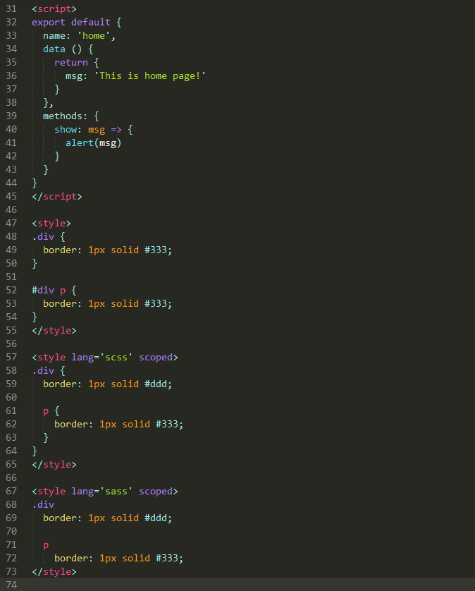

# Sublime Vue Completion

Sublime Text 3 Vue 语法高亮、代码提示插件！

已有的Vue语法高亮插件 [Vue Syntax Highlight](https://github.com/vuejs/vue-syntax-highlight)，虽然提供了单页Vue组件的语法高亮显示，但是有两点我个人用起来不是很方便。

1. 插值部分的高亮显示直接使用JavaScript语法高亮，这样混在HTML中辨识度不高，不方便阅读。

2. 没有提供对应的自动补全功能。

为了提高在Sublime中Vue的编码体验，诞生了这款Vue语法高亮、代码提示插件！

## 安装

- Git

用git克隆到Sublime的插件安装目录。

- Zip

下载zip包，将其解压到Sublime的插件安装目录。

## 设置

为了提高代码的补全效率，需要选择菜单(Preferences > Settings)，在打开的Preferences.sublime-settings用户配置文件中加入下面的代码：

```js
"auto_complete_triggers":
[
  {
    "characters": "abcdefghijklmnopqrstuvwxyz< :.@",
    "selector": "text.html"
  }
],
```



## 功能

1. 模板、脚本、样式的高亮显示。

2. 插值语法等表示JS操作的属性值均高亮显示，用于区分其他常规属性值和文本内容。

3. 语法文件基于HTML，不影响Emmet的功能使用。

4. 屏蔽了Sublime自带的HTML补全，建立新的补全机制，除了拥有HTML标签的自动补全外，还提供了常用Vue组件和指令的补全功能。

5. 自动补全完全采用配置文件的形式，可扩展性高。




## 后续

1. 暂时还没有提供Vue脚本的补全和提示功能。

2. Sass和Scss的语法高亮，基于 [Sass插件](https://packagecontrol.io/packages/Sass)。
