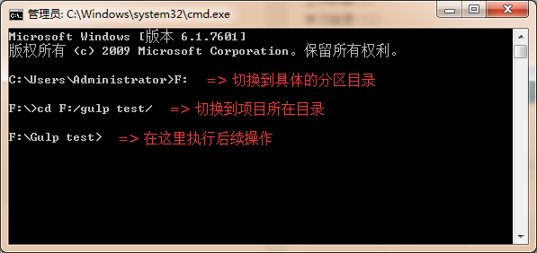

# Gulp的安装与使用

## 目录定位

首先，在命令行窗口中定位到项目所在目录：

然后，按照下面的步骤安装Gulp并运行范例。

## 安装gulp

### 确保安装Node.js以及NPM安装包

查看已安装Node的版本号：

  node -v

查看已安装NPM的版本号：

  npm -v

如果没有安装，请至<http://nodejs.org/>下载安装，npm将会随着安装包一起安装。

### npm install -g gulp

全局环境安装Gulp。

1. npm是安装node模块的工具，执行install命令
2. -g表示在全局环境安装，以便任何项目都能使用它
3. gulp是将要安装的node模块的名字

### gulp -v

查看所安装的gulp模块的版本号，确认是否安装成功。

### npm install --save-dev gulp

将Gulp安装到项目本地。

### npm install gulp-jshint gulp-sass gulp-concat gulp-uglify gulp-rename --save-dev

安装相关依赖来满足下列需求：

* `gulp-jshint`：检查Javascript
* `gulp-sass`：编译Sass（或Less之类的）文件
* `gulp-concat`：合并Javascript
* `gulp-uglify`：压缩JavaScript
* `gulp-rename`：重命名Javascript

## 创建gulpfile.js

在需要执行gulp操作的某个项目文件夹中，创建gulpfile.js脚本文件，用于配置所需执行的任务列表。

<pre class="jsCode">
// 引入 gulp
var gulp = require('gulp');

// 引入组件
var jshint = require('gulp-jshint');
var sass = require('gulp-sass');
var concat = require('gulp-concat');
var uglify = require('gulp-uglify');
var rename = require('gulp-rename');

// 检查脚本
// Link任务会检查src/目录下的js文件有没有报错或警告。
gulp.task('lint', function() {
   return gulp.src('./src/*.js')
    .pipe(jshint())
    .pipe(jshint.reporter('default'));
});

// 编译Sass
// Sass任务会编译scss/目录下的scss文件，并把编译完成的css文件保存到/css目录中。
gulp.task('sass', function() {
  return gulp.src('./scss/*.scss')
    .pipe(sass())
    .pipe(gulp.dest('./dist'));
});

// 合并，压缩文件
// scripts任务会合并src/目录下得所有的js文件并输出到dist/目录
// 然后gulp会重命名、压缩合并的文件，也输出到dist/目录。
gulp.task('scripts', function() {
  return gulp.src('./src/*.js')
    .pipe(concat('all.js'))
    .pipe(gulp.dest('./dist'))
    .pipe(rename('all.min.js'))
    .pipe(uglify())
    .pipe(gulp.dest('./dist'));
});

// 默认任务
// 使用.run()方法关联和运行上面定义的任务
// 使用.watch()方法去监听指定目录的文件变化，当有文件变化时，会运行回调定义的其他任务。
gulp.task('default', function(){

  gulp.run('lint', 'sass', 'scripts');

  // 监听脚本文件
  gulp.watch('./src/*.js', function(){
    gulp.run('lint');
  });

  // 监听Scss文件
  gulp.watch('./scss/*.scss', function(){
    gulp.run('sass');
  });
});
</pre>

## 执行任务

执行任务之前，需要将CMD窗口的目录切换至gulpfile.js文件所在的目录。

执行默认的Gulp任务：

  gulp

上面的语句相当于:

  gulp default

当然，也可以执行Gulpfile.js中的任意任务，比如：执行sass任务：

  gulp sass

## 卸载插件

卸载已安装的插件，只需要在项目工作的根目录下，执行如下所示的命令行即可：

  npm uninstall gulp-uglify
